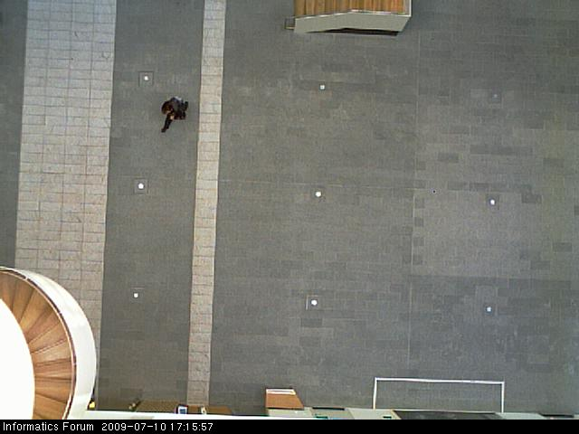
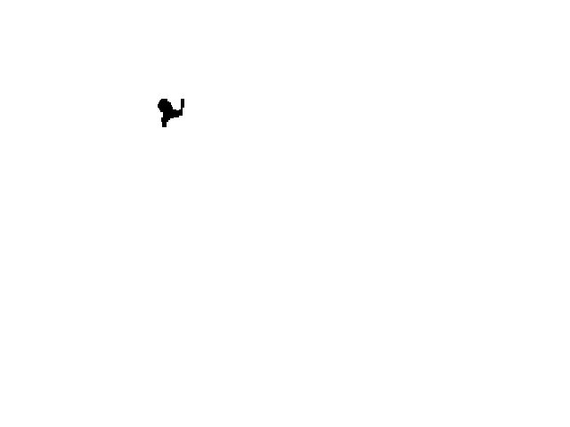
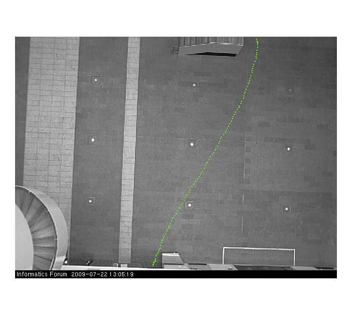
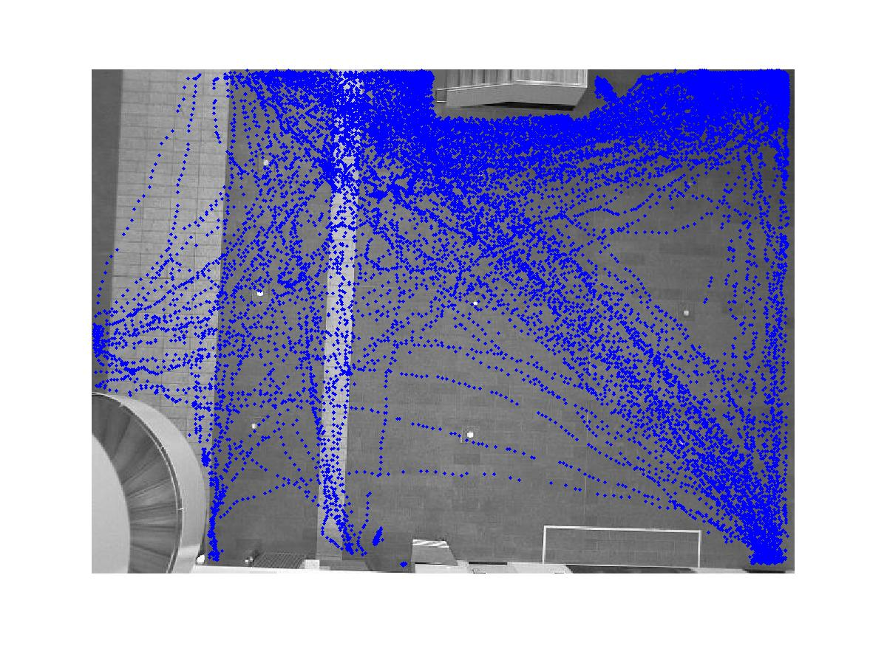
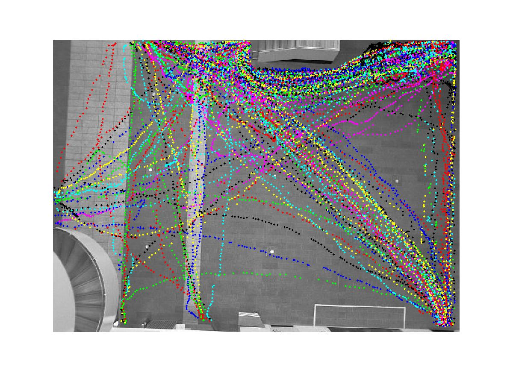

# Edinburgh Informatics Forum Pedestrian Database

## Introduction
The dataset consists of a set of detected targets of people walking through the Informatics Forum, the main building of the School of Informatics at the University of Edinburgh. The data covers several months of observation which has resulted in about 1000 observed trajectories each working day. By July 4, 2010, there were 27+ million target detections, of which an estimated 7.9 million were real targets, resulting in 92,000+ observed trajectories.

A view of the scene and image data from which the detected targets are found is:

The main entry/exit points (marked) are at the bottom left (front door), top left (cafe), top center (stairs), top right (elevator and night exit), bottom right (labs). Occasionally, there are events in the Forum which mean that there are many detected targets and tracking is rather difficult. There may be some false detections (noise, shadows, reflections). Normally, only about 30% of the captured frames contain a target and normally there are only a few targets in each frame (1 target in 46% of active frames, 2:25%, 3:14%, 4:8%, 5:4% 6-14:3% of time). There are occasional events in the recorded data, which may result in many 10s or 100s targets detected. Also, sometimes fixed furniture was moved into the field of view which resulted in a constant detection of the furniture in every frame. This accounts for several days (Jul 30, Aug 13) where the file sizes are much larger than usual.

The camera is fixed overhead (although it might drift and vibrate a little over time) approximately 23m above the floor. The distance between the 9 white dots on the floor is 297 cm vertically and 485 cm horizontally. The images are 640x480, where each pixel (horizontally and vertically) corresponds to 24.7 mm on the ground. The capture rate is about 9 frames per second depending on the local ethernet and capture host machine loads. Unfortunately, the sample rate can vary over short periods. Sometimes the capture program crashed, so some capture files may not cover all of a day. Since each captured frame is relatively independent of captured frames more than 10-20 seconds later, this should not make a difference.

The dataset does not consist of the raw images (although a short set of frames of 1 person is [here](http://homepages.inf.ed.ac.uk/rbf/FORUMTRACKING/forumoverheadimagesubset.tar)). It contains a summary of each detected target in each image, namely:

- the description of a bounding box for the target and
-an RGB histogram that summarises the target pixels.

The histogram has 64 bins, each counting the number of target foreground pixels that lie in a given colour range. Each RGB colour was quantized into 4 ranges (hence the 4*4*4=64 bins). Because the images are a little dark, we adjusted the bin boundaries to use the full histogram better than if we had used equal sized bins. The quantization we finally chose was four bins with ranges 0:[0..19], 1:[20..49], 2:[50..89], 3:[90..255].

To illustrate the image source process, we start with a frame:

Detection uses an absolute difference from a fixed median image plus a weighted first eigenimage, which mainly encodes lighting variations. The binary image of the detected target is:

A typical detected target is:

from which this colour histogram is extracted:

A typical set of blobs for a single target is shown here, where each dot marks the center-of-mass of the detected target:

A view of a few hundred of the trajectories is:

A view of the corresponding tracked trajectories is:

A view of the corresponding spline fits to the trajectories is:

**Source image files:** We did not keep the source image files for the 92K tracks because this would have been about 5-10 Tb. We include here a 1000 frame sample captured at a later date. There are no detections or tracks for this data.

**Detection data files:** Each file contains one or more header lines: BEGIN TTT where TTT is the "number of seconds since (00:00:00 UTC, January 1, 1970)". Then, for each frame thereafter in which a target is detected there is a line F M T where T is the time since the start of this file in 0.1 second units and M is the number of the downloaded frame since the start of the program. Due to occasional detector program crashes, there may be more than one BEGIN statements and even the occasional reset without the BEGIN, which can be seen by the M and T values restarting. For each frame, there are one or more detected blobs. Each blob is encoded on one line in the file in the form: [blob id]: [number of pixels] [x_center] [y_center] [x_top_left] [y_top_left] [width] [height] HISTOGRAM. The blob ids are notional and the same target in the next frame may have a different blob number. The number of pixels is a count of the pixels that are detected as being foreground inside the bounding box. The (x_center,y_center) is the center of mass of the foreground pixels. The bounding box is defined from the pixel (x_top_left, y_top_left) at the top left with the given width and height. The colour histogram bin order is rgb : 000,001,002,003,010,011,012,013,020,...,033,100,...,133,200,...233,300...333, where indices 0,1,2,3 cover the ranges given above. So bin 032 means red range 0, green range 3 and blue range 2. NOTE: these files include spurious targets as well as moving people. This includes: packages, tables, chairs, shadows, highlights and other 'non-targets'. Much of this has been removed before this file was produced, but a lot remains. The "Number of detections in tracking" column below is the number of detections that were allocated to actual tracked moving people. There are a few people that were detected, but not included in the tracked trajectories, usually because their detections were intermittent (ie. were not detected for 3 or more frames).

**Tracked target files:** These files contain sets of detections that have been tracked together into a single target's trajectory. Tracker files start with "% Total number of trajectories in file are [Number]", where Number defines the number of trajectories. Files contain the information in the form of a Matlab structure. The trajectory points and the properties are in two different variables with same identifier.
Each trajectory has a different identifier like "R1" for trajectory number 1 and "R2" for trajectory number 2 and so on. The first variable is
Properties.{Identifier}= [ Number_of_Points_in_trajectory, Start_time, End_Time, Average_Size_of_Target,Average_Width, Average_height, Average_Histogram ];. The histogram has the same format as in the detection file. The second variable contains the full trajectory as TRACK.{Identifier}= [[ centre_X(1) Centre_Y(1) Time(1)] ; [ centre_X(2) Centre_Y(2) Time(2)] ........ and so on .......... until ........ [ centre_X(end) Centre_Y(end) Time(end) ]];. The size of tracked files is about 1MB each.

**Tracked spline files:** These files contain sets of 6 point spline descriptions of the tracked trajectory. The spline file contains the average error of the spline fit to the tracked trajectories, and the control points. This is for each trajectory produced by tracker with same identifier as tracker. The first line of spline file is "% Total number of trajectories in file are [Number]", where Number defines the number of trajectories. "X and Y are normalized by dividing 640 and 460 respectively" and "Image size is 640*460". Normalization is done because the spline fit works for variables in the range [0,1], so we transformed the values of the trajectory points to fall into [0,1]. The file contain the information in the form of a Matlab structure. Identifiers of each spline are the same as given in the tracker file for the corresponding trajectory . Deviation and Control points are stored as Deviation.{Identifier}= [ Standard deviation ];. This is the average distance between the tracked point and the closest point on the spline.
The control points are stored as: Controlpoints.{Identifier}= [[Controlpoint_x1 Controlpoint_y1]; [Controlpoint_x2 Controlpoint_y2]........ and so on until six points ]]; The size of spline files is about 80KB each. The splines were fit based on a temporal parameterisation, so regions with more detections get more control points. This has the side effect that trajectories where people stand still for long periods of time are not represented accurately. People using the data might also consider investigating a spatial parameterisation whereby control points are spaced uniformly along the spatial trajectory.

The data files can be downloaded by clicking on a file and then unzipping them.

<!--
| Detected Target Filename | Size (MB) | Number of Detections | Tracked	Target Filename | Number of Trajectories | Number of detections in tracking | Target Spline in tracking |

Aug.24	8	254071	tracks.Aug24	664	76260	spline.Aug24
Aug.25	2.2	70725	tracks.Aug25	474	41164	spline.Aug25
Aug.26	10.9	320393	tracks.Aug26	1992	191981	spline.Aug26
Aug.27	12.8	389793	tracks.Aug27	2046	201269	spline.Aug27
Aug.28	8.5	263960	tracks.Aug28	1666	150571	spline.Aug28
Aug.29	2.9	263960	tracks.Aug29	304	27279	spline.Aug29
Aug.30	1.8	69840	tracks.Aug30	126	8314	spline.Aug30
Sep.01	24.1	920485	tracks.Sep01	2342	217559	spline.Sep01
Sep.02	8.7	268967	tracks.Sep02	1478	127807	spline.Sep02
Sep.04	18.9	593516	tracks.Sep04	1701	165140	spline.Sep04
Sep.05	4.6	150050	tracks.Sep05	302	28142	spline.Sep05
Sep.06	1.7	63237	tracks.Sep06	185	14790	spline.Sep06
Sep.07	31.5		N/A		N/A
Sep.08	17		N/A		N/A
Sep.09	12.5		N/A		N/A
Sep.10	13.8	453259	tracks.Sep10	1266	104594	spline.Sep10
Sep.11	6.5	208332	tracks.Sep11	1054	70593	spline.Sep11
Sep.12	1.1	34804	tracks.Sep12	253	24168	spline.Sep12
Sep.13	1.0	33569	tracks.Sep13	157	11915	spline.Sep13
Sep.14	8.6	452786	tracks.Sep14	1095	85762	spline.Sep14
Sep.15	22		N/A		N/A
Sep.16	13.8	432475	tracks.Sep16	1301	112710	spline.Sep16
Sep.17	27.8		N/A		N/A
Sep.18	14.8	467279	tracks.Sep18	1182	95853	spline.Sep18
Sep.19	8.1	344066	tracks.Sep19	765	43827	spline.Sep19
Sep.20	1	39641	tracks.Sep20	82	5391	spline.Sep20
Sep.21	6	237310	tracks.Sep21	622	51664	spline.Sep21
Sep.22	14	427189	tracks.Sep22	1214	94518	spline.Sep22
Sep.23	14	421778	tracks.Sep23	1927	171060	spline.Sep23
Sep.24	11.8	390636	tracks.Sep24	338	22521	spline.Sep24
Sep.25	13.2	418718	tracks.Sep25	474	70386	spline.Sep25
Sep.26	24.6		N/A		N/A
Sep.27	17	570727	tracks.Sep29	492	59262	spline.Sep27
Sep.28	10.2	314295	tracks.Sep29	1592	142488	spline.Sep28
Sep.29	19.2	610724	tracks.Sep29	1451	132093	spline.Sep29
Sep.30	14.3	469568	tracks.Sep30	1195	106941	spline.Sep30
Oct.02	13	268967	tracks.Oct02	1478	127807	spline.Oct02
Oct.03	2.1	71977	tracks.Oct03	209	27769	spline.Oct03
Oct.04	2.3	109837	tracks.Oct04	101	5797	spline.Oct04
Oct.05	17	550115	tracks.Oct05	1106	86827	spline.Oct05
Oct.06	13.5	423540	tracks.Oct06	1581	146421	spline.Oct06
Oct.07	15.3	464579	tracks.Oct07	939	67948	spline.Oct07
Oct.08	11.2	333924	tracks.Oct08	1325	106863	spline.Oct08
Oct.09	13.5	406033	tracks.Oct09	2046	193215	spline.Oct09
Oct.10	9.8	453259	tracks.Oct10	1266	104594	spline.Oct10
Oct.11	2.1	79589	tracks.Oct11	221	16436	spline.Oct11
Oct.12	28.9	1258247	tracks.Oct12	1470	97836	spline.Oct12
Oct.13	11	330339	tracks.Oct13	1548	106031	spline.Oct13
Oct.14	17.3	567833	tracks.Oct14	742	52376	spline.Oct14
Oct.15	14.6	524403	tracks.Oct15	1456	78523	spline.Oct15
Dec.06	1.2	50160	tracks.Dec06	99	6884	spline.Dec06
Dec.11	5.3	158949	tracks.Dec11	901	98140	spline.Dec11
Dec.14	9.4	292875	tracks.Dec14	1000	79519	spline.Dec14
Dec.15	14.7	452786	tracks.Dec15	1092	102961	spline.Dec15
Dec.16	11	361456	tracks.Dec16	899	56163	spline.Dec16
Dec.18	7	201854	tracks.Dec18	972	84528	spline.Dec18
Dec.19	1.3	47230	tracks.Dec19	83	7978	spline.Dec19
Dec.20	1.1	40790	tracks.Dec20	73	9579	spline.Dec20
Dec.21	1.3	42839	tracks.Dec21	87	9527	spline.Dec21
Dec.22	6.5	229257	tracks.Dec22	599	47271	spline.Dec22
Dec.23	4.6	154641	tracks.Dec23	307	34005	spline.Dec23
Dec.24	7	342588	tracks.Dec24	515	23938	spline.Dec24
Dec.25	13.9		N/A		N/A
Dec.26	15.2		N/A		N/A
Dec.27	8.5		N/A		N/A
Dec.28	14.5		N/A		N/A
Dec.29	1.2	56630	tracks.Dec29	174	8181	spline.Dec19
Dec.30	1.7	76178	tracks.Dec30	275	14928	spline.Dec30
Dec.31	0.6	25198	tracks.Dec31	68	4250	spline.Dec31
Jan.01	0.6	25648	tracks.Jan01	14	429	spline.Jan01
Jan.02	0.7	33298	tracks.Jan02	51	3238	spline.Jan02
Jan.03	0.7	32813	tracks.Jan03	33	1930	spline.Jan03
Jan.04	1.3	43840	tracks.Jan04	224	20758	spline.Jan04
Jan.05	5.3	157060	tracks.Jan05	902	72625	spline.Jan05
Jan.06	9.2	286314	tracks.Jan06	702	55357	spline.Jan06
Jan.07	6.6	202937	tracks.Jan07	1165	98138	spline.Jan07
Jan.08	4.9	152989	tracks.Jan08	891	70073	spline.Jan08
Jan.09	16.6		N/A		N/A
Jan.10	2.6	119608	tracks.Jan10	116	6363	spline.Jan10
Jan.11	7.4	212927	tracks.Jan11	1583	150547	spline.Jan11
Jan.12	6.8	202268	tracks.Jan12	1070	90762	spline.Jan12
Jan.13	9	272972	tracks.Jan13	1580	160048	spline.Jan13
Jan.14	13.1	409309	tracks.Jan14	962	76947	spline.Jan14
Jan.15	9.3	285990	tracks.Jan15	1502	148132	spline.Jan15
Jan.16	1	37459	tracks.Jan16	124	10387	spline.Jan16
Jan.17	6.1	269312	tracks.Jan17	454	23493	spline.Jan17
Jan.18	9.2	269312	tracks.Jan18	1025	73036	spline.Jan18
Jan.19	10.4	325341	tracks.Jan19	1203	89260	spline.Jan19
May 29	1.0	33640	tracks.May29	167	17829	spline.May29
May 30	0.6	20413	tracks.May30	136	11334	spline.May30
May 31	5.8	170735	tracks.May31	1015	126811	spline.May31
Jun 2	13.0	406473	tracks.Jun02	915	69920	spline.Jun02
Jun 3	12.6	371085	tracks.Jun03	1658	162106	spline.Jun03
Jun 4	11.6	347280	tracks.Jun04	1975	169102	spline.Jun04
Jun 5	0.6	20734	tracks.Jun05	115	9264	spline.Jun05
Jun 6	0.6	17855	tracks.Jun06	132	12176	spline.Jun06
Jun 8	6.8	206832	tracks.Jun08	853	67181	spline.Jun08
Jun 9	4.2	124405	tracks.Jun09	531	66483	spline.Jun09
Jun 11	5.7	169948	tracks.Jun11	949	103278	spline.Jun11
Jun 12	0.1	2345	tracks.Jun12	5	209	spline.Jun12
Jun 14	9.1	267092	tracks.Jun14	1677	145965	spline.Jun14
Jun 16	11.0	317900	tracks.Jun16	2126	183230	spline.Jun16
Jun 17	13.1	395091	tracks.Jun17	2064	195349	spline.Jun17
Jun 18	11.8	344925	tracks.Jun18	2283	193658	spline.Jun18
Jun 20	2.8	78422	tracks.Jun20	677	63979	spline.Jun20
Jun 22	5.2	147304	tracks.Jun22	852	88737	spline.Jun22
Jun 24	12.0	360129	tracks.Jun24	1413	141791	spline.Jun24
Jun 25	6.5	194079	tracks.Jun25	1218	123516	spline.Jun25
Jun 26	0.7	20026	tracks.Jun26	118	13713	spline.Jun26
Jun 29	6.4	182450	tracks.Jun29	1118	102752	spline.Jun29
Jun 30	12.0	353554	tracks.Jun30	1864	171008	spline.Jun30
Jul 01	8.6	250529	tracks.Jul01	1262	111230	spline.Jul01
Jul 02	3.8	109622	tracks.Jul02	739	81610	spline.Jul02
Jul 04	3.9	118724	tracks.Jul04	652	50756	spline.Jul04
Jul 11	0.7	26489	tracks.Jul11	59	6094	spline.Jul11
Jul 12	6.7	204759	tracks.Jul12	838	93222	spline.Jul11
Jul 13	5.6	168670	tracks.Jul13	959	90736	spline.Jul13
Jul 14	25.8	855589	tracks.Jul14	2804	384479	spline.Jul14
Jul 17	0.7	27435	tracks.Jul17	70	5429	spline.Jul17
Jul 18	0.6	26185	tracks.Jul18	63	4625	spline.Jul18
Jul 19	9.0	256490	tracks.Jul19	1567	139437	spline.Jul19
Jul 20	23.2	723206	tracks.Jul20	2631	272229	spline.Jul20
Jul 21	22.9	686813	tracks.Jul21	2172	240424	spline.Jul21
Jul 22	7.6	216624	tracks.Jul22	1508	159866	spline.Jul22
Jul 23	3.6	105806	tracks.Jul23	680	41849	spline.Jul23
Jul 25	0.5	16183	tracks.Jul25	92	9694	spline.Jul25
Jul 26	7.6	238275	tracks.Jul26	1089	110071	spline.Jul26
Jul 27	3.7	109111	tracks.Jul27	429	51877	
Jul 28	9.3	283965	tracks.Jul28	1247	125431	spline.Jul28
Jul 29	0.9	29626	tracks.Jul29	98	9572	spline.Jul29
Jul 30	8.8	250782	tracks.Jul30	1574	188325	spline.Jul30
Aug 01	2.5	85702	tracks.Aug01	146	22195	spline.Aug01
Total (before July 19)		28975370		95998	8382100	
-->

**N/A - tracking is not available on that particular day, usually because there was some event happening so there were a lot of people standing around rather than walking on a focused trajectory.**

Programs to do the detection, tracking and spline fitting and abnormal behaviour detection can be downloaded from here:

- detection
- [tracking](http://homepages.inf.ed.ac.uk/rbf/FORUMTRACKING/SINGH/Singh_Code/TRACKER.zip)
- [fitting spline](http://homepages.inf.ed.ac.uk/rbf/FORUMTRACKING/SINGH/Singh_Code/FITTINGSPLINES.zip)
- [abnormal behaviour detection](http://homepages.inf.ed.ac.uk/rbf/FORUMTRACKING/SINGH/Singh_Code/AbnormalDetection.zip)

This data collection was initiated by Barbara Majecka as part of her MSc project. Please cite this dissertation if you use the data in a publication:s B. Majecka, "Statistical models of pedestrian behaviour in the Forum", MSc Dissertation, School of Informatics, University of Edinburgh, 2009. The spline fitting code was developed by Rowland Sillito. Improvements to the tracking was by Gurkirt Singh as part of a summer internship. This resulted in the Tracks and Splines datasets. You can read a report of his work here.
